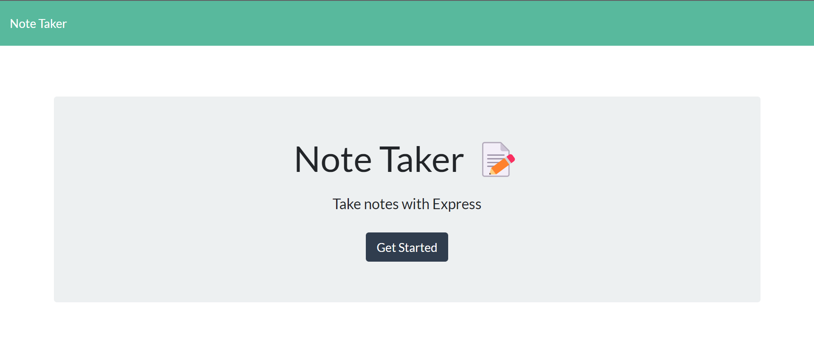

# note-taker-fullstack

## Functionality

When you open the application, you have to navigate to the notes page @ '/notes', where you will be shown any previously listed notes, and be prompted to enter in a new note. When you click save, the note appears in the list and can be clicked on to see the contents of what that note were. And you can refresh, which will keep any previously saved note. And after refreshing you would be able to permanently delete the note from the list.

## Issues

The only issue is that when you save a note, you have to refresh before being able to delete it. This is because the function to get and render the items form the json file into list items, though being in the promise after posting the note, doesn't update the data-note attribute right away to give the new note its respective id that it was assigned to be used in the delete function.

## Fixed

While typing out the issues section, I had a thought on how to fix the issue and let the note be able to be deleted right away if need be. I put the function that would generate a random id in the index.js rather than hooking it up on the server side. So, each time a new note is added its assigned an id right away which is apart of it's data-note attribute and that allows the note to be deleted right away having immediate access to that id to do so.

## Dev Notes

This was a fun assignment that helped me not only learn, but feel really comfortable with server side code and what can be done with express. I am very much looking forward to building on the knowledge I have gained with this assignment.

## Heroku Deployment Link

<a href="https://serene-savannah-94213.herokuapp.com/">Click to test live application</a>

